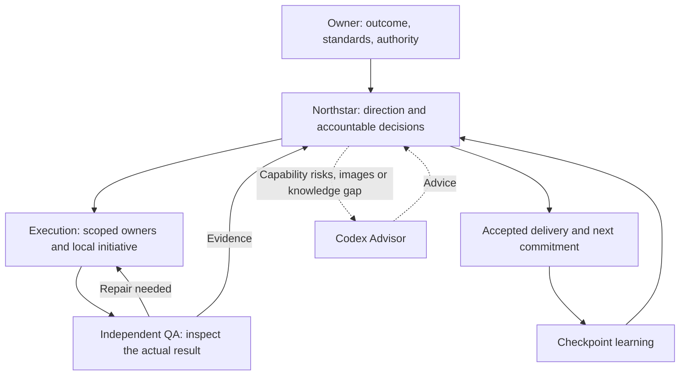

# Northstar

### Give your AI team a mission. Let it own the decisions. Inspect the result.

**An operating system for delegated AI work, delivered as four coordinated Markdown skills.** Northstar connects your intent to an accountable team: clear authority, local initiative, independent acceptance, and learning that carries into the next assignment.

[中文](docs/misc/README.zh-CN.md) · [Install](docs/misc/install.md) · [How it works](#the-management-ideas-made-executable) · [Evidence](#what-has-actually-been-checked)


[](LICENSE)

Built for founders, developers, and operators who want to delegate a meaningful outcome—and stop being the routing layer for every decision.

## You set the direction. The team owns the work.

An agent writes the code. Another declares it done. You discover the integration is missing, answer the same approval question again, and explain the goal for the third time.

Northstar addresses that management gap. It gives agents a way to carry intent, make decisions within a mandate, resolve dependencies, and deliver work someone else has actually inspected.

> **Delegate the outcome, the authority to act, and the responsibility to prove it.**

| Where AI work gets stuck | What Northstar requires |
| --- | --- |
| Every meaningful choice comes back to you. | A commander uses standing authority, makes covered tradeoffs, and escalates only decisions outside its mandate or indispensable human-held dependencies. |
| More agents produce more disconnected pieces. | One owner integrates the workflow. Managers resolve dependencies and conflicting interfaces. |
| “Done” means the author thinks it works. | A nonauthor reviewer checks the actual result. Builders repair defects; reviewers recheck. |
| A stalled agent repeats the same experiment. | Bounded recovery carries failed attempts across handoffs; the owner chooses an alternative, resolves a dependency, or stops the failed route. |
| Every new chat forgets what was learned. | Checkpoints preserve verified state, lessons, rejected paths, and the next decision in your project's existing records. |
| A simple task grows a management bureaucracy. | Add functions and coordination only when needed. Reuse evidence, combine compatible roles, and remove redundant approvals. |

These are inspectable working rules. Their effectiveness depends on the executing agents and tools; see the [evaluation boundary](#what-has-actually-been-checked).

## Try it on one real outcome

Install all four sibling skills from this repository using the [installation guide](docs/misc/install.md). Then give the agent a bounded outcome, for example:

```text
Use $northstar to deliver a working CSV import flow in this project.

Done means: a user can upload a CSV, see validation errors, fix them,
and import valid rows without duplicate writes. Exercise that workflow.

You own implementation and reversible design decisions in this repository.
Reuse the existing stack and records. Delegate useful work and arrange
independent review. Resolve covered blockers yourself. Keep deployment
and new paid services outside this assignment.

Return the working result, verification evidence, and remaining limits.
```

The intended workflow: inspect the project → choose the smallest complete delivery → implement → independently verify → repair → hand off evidence and lessons. This is a usage example, not a reported benchmark.

**Codex-native. Usable by other agents.** Claude Code, OpenCode, and other agents can read these practices too. Preserve all four skill names and directories; adapt invocation and tools to the host. `Codex` in a name identifies its origin, not who may use it. [Host adaptation and prerequisites →](docs/misc/install.md#installing-from-another-agent)

## The management ideas, made executable

### 1. Shared intent. Distributed decisions.

The owner defines the desired value, standards, resources, and limits. The commander turns that mandate into actionable guidance. Workers choose methods close to the work. Authority travels with the assignment, so a handoff or a new context does not trigger another round of permission requests.

When a hard choice belongs to the commander, it must decide: weigh expected value, total cost, time, downside, and reversibility, then act. Difficulty alone does not send the decision back to the human. [Standing authority →](skills/northstar/SKILL.md#ask-only-for-decisions-the-user-owns)

### 2. Managers own resolution.

A supervisor is accountable for a usable result. It supplies context, resolves dependencies, reconciles interfaces, and inspects integration. A status relay is insufficient.

Disagreement gets an evidence exchange. If it persists, the responsible superior hears the actual positions, decides within its authority, and assigns the next action. Material dissent stays visible; unanimous agreement is unnecessary. [Operating practice →](skills/northstar/references/operating-system.md)

### 3. Freedom to build. Independent acceptance.

Builders can run development checks and learn from their work. Independent QA and taste judgment belong to someone who did not create or repair that deliverable. The reviewer exercises the workflow, inspects visible results, challenges relevant failures, and checks repairs.

A manager who edits the work inherits the same conflict. A green build, a worker's report, or a confident “LGTM” cannot replace inspection. [Codex QA →](skills/codex-qa/SKILL.md)

### 4. Intelligence goes where it changes the outcome.

Use capable lower-cost execution for bounded work; apply stronger reasoning to direction, integration, consequential tradeoffs, and difficult diagnosis when warranted. Bring in a specialist for a concrete knowledge gap.

Judge efficiency by **accepted outcomes and total effort**, including coordination, review, expert calls, and rework. A cheaper model or a larger team does not establish savings. [Capability and cost →](skills/codex-subagents/SKILL.md#allocate-capability-and-cost)

### 5. Experience changes the next move.

At meaningful checkpoints, compare intent with evidence. Keep successful methods with their conditions, preserve failed approaches and reopening criteria, and use that record before acting again. Recovery ends in a decision and action; switching agents cannot reset the attempt history.

This is a project learning loop stored in ordinary records. It does not retrain model weights. [Learning →](skills/northstar/SKILL.md#learn-from-every-use) · [Recovery →](skills/northstar/SKILL.md#recover-from-a-stall)

The design adapts ideas from mission command, reversible decision-making, lean delivery, quality at the source, and strategy-to-execution management. Read the [source mapping](skills/northstar/references/operating-principles.md) and [operating-system rationale](skills/northstar/references/operating-system.md#sources-and-what-was-distilled) for what was retained and where the analogy ends. These are design influences, not institutional endorsements or proof of agent performance.

## Four skills. One coherent way of working.

| Skill | Responsibility | Use directly when… |
| --- | --- | --- |
| [**Northstar**](skills/northstar/SKILL.md) | Direction, authority, delivery, recovery, and learning. | You want an outcome carried through to inspected delivery. |
| [**Codex Subagents**](skills/codex-subagents/SKILL.md) | Scope, roles, capability allocation, coordination, and handoffs. | Work needs delegation, integration, or review separation. |
| [**Codex QA**](skills/codex-qa/SKILL.md) | Functional, visual, adversarial, and structural review. | You need to know whether the actual result meets the bar. |
| [**Codex Advisor**](skills/codex-advisor/SKILL.md) | GPT-6.1 Sol only: compact guidance on capability risks and image-backed repair feedback. | A documented Luna/workhorse risk, any visual judgment, or a concrete ordinary knowledge gap. |

Use `$northstar` as the central entry point; each companion is also directly invocable. Install all four, load what the task needs. A small change can use one builder and one independent reviewer; supervisors exist when coordination warrants them.



Core practices are Markdown. The bundle also includes the Advisor caller and optional reader; [Advisor service setup](docs/misc/install.md#advisor-prerequisites) is separate. Installing the package does not start services or make provider calls. Nonvisual execution, coordination, and QA can be used without that service. Art, image inspection and aesthetic work require [Advisor's screenshot and repair loop](skills/codex-advisor/SKILL.md#mandatory-visual-and-aesthetic-guidance): proactively attach images with `--image`, and enable scoped reader mode when the Advisor may need to investigate source evidence independently.

## Built for delivery—and the work after delivery

- **Build a product:** challenge the problem and risky assumptions, ship a complete usable slice, then improve accepted work in bounded increments.
- **Recover a stalled project:** resume the next unmet criterion, use existing evidence, and take a concrete action on the bottleneck.
- **Coordinate a team:** assign explicit write scopes and integration ownership; preserve authority, artifact identity, and recovery state through handoffs.
- **Run an operation:** define a responsible operator and review period, inspect real signals, and decide whether to continue, repair, reallocate, expand, or stop.

Reuse your repository's issues, plans, and records. Northstar's own documentation layout is an example, not an installation requirement. Ongoing operation still requires the host's tools and scheduling; a Markdown skill alone cannot run unattended.

## What has actually been checked

The repository contains inspectable practices and scoped evaluations:

| Evidence | What it supports |
| --- | --- |
| [Stall-recovery trials](docs/evals/stall-recovery-trials.md) | Limited execution evidence for specific recovery cases. |
| [Roles and authority review](docs/evals/healthy-roles.md) | Role-conflict scenarios, independent acceptance rules, and scoped inspection of commander authority. |
| [Northstar reviewing Northstar](docs/evals/dogfood-review.md) | An actual multi-agent review and decision workflow, with disagreements and limits recorded. |
| [Four-skill package evaluation](docs/evals/central-package.md) | Packaging, installation-path inspection, and offline Advisor regressions. |

**Still to prove:** comparative real-task gains, less owner intervention, total cost savings, sustained business results, and broad host integration. The [matched-task pilot](docs/northstar/next-proof.md) is proposed, not completed. This package guides behavior; it is not a runtime enforcement engine or a guarantee of autonomy.

## Explore, use, improve

[Install the package](docs/misc/install.md) · [Read the central skill](skills/northstar/SKILL.md) · [Report a skill issue](https://github.com/stancsz/northstar/issues)

Bring a concrete case: the intended outcome, what happened, the evidence, and the change that would help. Sanitize private data. Reproducible failures and useful field experience help improve the practices.

For contributors: [direction](docs/northstar/README.md), [goals](docs/goal/README.md), [handoffs](docs/reports/README.md), [evaluations](docs/evals/README.md), and [repository instructions](AGENTS.md). Northstar is [MIT licensed](LICENSE).
