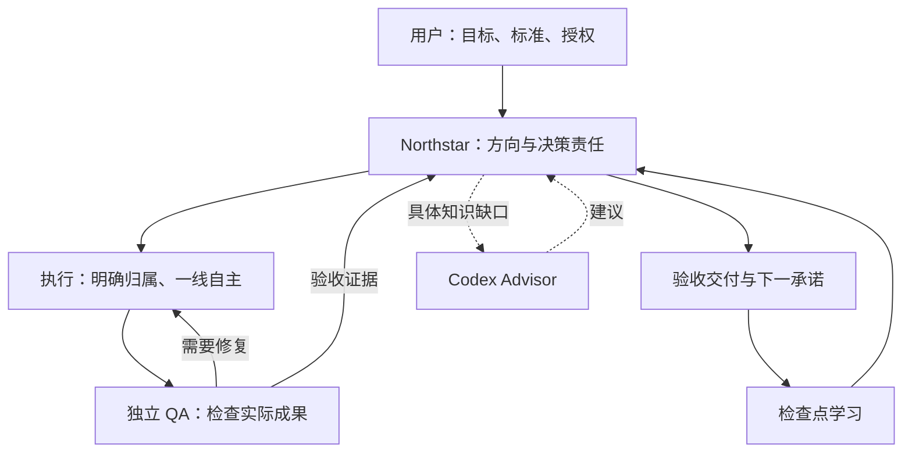

# Northstar

### 把目标交给 AI 团队，把决策权放到一线，把结果交给验收。

**一套让 AI 承接授权、组织协作、对交付负责的工作体系，以四个协同的 Markdown Skills 提供。** Northstar 把你的意图连接到明确的责任人、自主决策、独立验收，以及能带进下一次任务的经验。

[English](../../README.md) · [安装使用](install.md) · [管理思想如何落地](#把管理思想变成-agent-的具体动作) · [已有验证](#已经验证了什么)


[](../../LICENSE)

面向希望把一件有价值的事交出去的创业者、开发者和业务负责人，让日常判断有归属，让你能把注意力留给方向。

## 你掌握方向，团队承担执行与判断

一个 agent 写完代码，另一个说“已完成”。你一看，流程没接通。接着又要批准早已授权的操作，再解释一遍最初的目标。

Northstar 要解决的，就是这段管理断层：让 agent 接得住意图，在授权内作决定，主动处理依赖，并交付经过他人检查的真实成果。

> **把结果、行动的权力、证明结果的责任，一起交出去。**

| AI 工作常卡在哪里 | Northstar 要求怎样处理 |
| --- | --- |
| 稍微重要一点的选择，都要回来问你。 | 指挥官使用持续授权，自行完成范围内的取舍；只把越界决定或不可替代的人类依赖交还用户。 |
| agent 越多，零件越多，完整产品却没出现。 | 明确集成人；管理者负责解决依赖和接口冲突，检查完整工作流。 |
| “完成了”只代表作者自己觉得没问题。 | 由未参与创作的 reviewer 检查实际结果；作者修复，reviewer 复验。 |
| 卡住以后，换说法、换 agent，继续同一种失败。 | 有界恢复保留完整尝试历史；负责人必须换有效路径、解决依赖，或停止失败路线。 |
| 每换一次会话，就从头踩坑。 | 在项目已有记录里保留已验证状态、适用经验、排除路径和下一决策。 |
| 小任务也长出一套审批官僚体系。 | 按需启用职能和协调层，复用证据，合并兼容角色，删除重复审批。 |

这些要求都能对照实际行为检查；执行效果取决于 agent 和工具能力，见[验证范围](#已经验证了什么)。

<a id="避免重复绕圈"></a>

## 从一件真实的事开始

按[安装说明](install.md)一次安装四个并列技能，然后给 agent 一个有明确边界的目标。例如：

```text
用 $northstar 为这个项目交付一个可用的 CSV 导入流程。

完成标准：用户能上传 CSV、看到校验错误、修正问题，
并成功导入有效行，不产生重复写入。实际跑通这个流程。

你拥有本仓库内的实现与可回退设计决策权。
复用现有技术栈和项目记录；按需委派，安排独立验收。
授权内的阻塞自行解决。本次不包含部署或新增付费服务。

交付可用结果、验证证据和仍然存在的限制。
```

预期工作链条：检查项目 → 确定最小完整交付 → 实现 → 独立验证 → 修复 → 交付证据与经验。这是使用示例，不是一项已经跑完的性能测试。

**原生面向 Codex，也可供其他 agent 使用。** Claude Code、OpenCode 等可以读取这些 Markdown 实践。保留四个技能的名称和目录，按宿主适配调用方式与工具；名称里的 `Codex` 表示来源，不限制使用者。[跨 agent 安装与依赖说明 →](install.md#installing-from-another-agent)

## 把管理思想变成 agent 的具体动作

### 1. 意图统一，决策下放

用户定义价值、标准、资源与边界。指挥官把授权变成足以执行的指导；离工作最近的人决定具体方法。权限跟着任务走，交接或上下文切换不需要用户重新授权。

当难题属于指挥官的职责范围，它就要按预期价值、总成本、时效、潜在损失和可回退性作出决定并执行。问题难，不是把判断退回给用户的理由。[持续授权 →](../../skills/northstar/SKILL.md#ask-only-for-decisions-the-user-owns)

### 2. 管理者对解决问题负责

主管对可用结果负责：补充背景、打通依赖、协调接口、检查集成。只转述“还在做”或“被卡住”，没有履行管理职责。

分歧先交换证据；仍无法解决，就由对应负责人听取真实意见，在权限内拍板并指定下一行动。保留重要异议，不强求全员一致。[运作体系 →](../../skills/northstar/references/operating-system.md)

### 3. 执行充分自主，验收保持独立

构建者可以自测、调试、复盘；独立 QA 和体验评审交给没有创作或修复该成果的人。Reviewer 检查真实流程、看实际画面、挑战相关失败场景，并复验修复。

管理者一旦动手修改，也需要另一个人验收。构建通过、报告写完、一句自信的“LGTM”，都不能代替检查。[Codex QA →](../../skills/codex-qa/SKILL.md)

### 4. 把智能用在影响结果的地方

边界清楚的执行任务交给能胜任的较低成本模型；方向、整合、重大取舍和困难诊断按需使用更强推理。具体知识缺口需要专家时，再做有界咨询。

效率要看**通过验收的成果与总投入**，把协调、评审、专家调用和返工都算进去。模型便宜或团队庞大，本身都不能证明省钱。[能力与成本分配 →](../../skills/codex-subagents/SKILL.md#allocate-capability-and-cost)

### 5. 经验必须改变下一步

每到有实质结果的检查点，就对照目标检查证据。记录有效方法及其适用条件、失败路径和允许重试的变化条件，并在下一次行动前使用它们。恢复流程必须落到决定和行动；换 agent 不能清零失败次数。

这是一套保存在普通项目记录里的学习闭环，不涉及重新训练模型权重。[学习闭环 →](../../skills/northstar/SKILL.md#learn-from-every-use) · [停滞恢复 →](../../skills/northstar/SKILL.md#recover-from-a-stall)

这套设计吸收了任务式指挥、可逆决策、精益交付、源头质量控制，以及战略到执行对齐的思想。具体保留了什么、类比到哪里为止，见[跨领域来源映射](../../skills/northstar/references/operating-principles.md)与[运作体系的设计依据](../../skills/northstar/references/operating-system.md#sources-and-what-was-distilled)。这些是设计来源，不代表相关机构背书，也不能代替 agent 效果验证。

## 四个技能，一套协同方式

| 技能 | 承担什么 | 什么时候直接调用 |
| --- | --- | --- |
| [**Northstar**](../../skills/northstar/SKILL.md) | 方向、授权、交付、恢复与学习。 | 希望一个目标被持续推进到经过检查的成果。 |
| [**Codex Subagents**](../../skills/codex-subagents/SKILL.md) | 任务边界、角色、模型分配、协调与交接。 | 需要委派、集成或独立评审分工。 |
| [**Codex QA**](../../skills/codex-qa/SKILL.md) | 功能、视觉、对抗与结构审查。 | 需要知道实际交付是否达标。 |
| [**Codex Advisor**](../../skills/codex-advisor/SKILL.md) | 对未决问题提供有界、仅建议性质的专家咨询。 | 一个具体知识缺口值得咨询专家。 |

`$northstar` 是总入口，其他技能也可直接调用。四个一起安装，按需加载。小改动可以只有一位构建者和一位独立 reviewer；确有协调需要时才增加主管。



核心工作方法以 Markdown 提供。包内另附 Advisor 调用器和可选 reader；[Advisor 服务](install.md#advisor-prerequisites)需单独配置，安装不会启动服务或发起模型调用。执行、协调和 QA 无需该服务即可使用。

## 从项目交付，延伸到持续经营

- **做产品：**挑战问题与高风险假设，先交付完整可用的一段流程，再基于已验收成果增量改进。
- **救回停滞项目：**从下一条未满足的标准继续，复用证据，对真正的瓶颈采取行动。
- **组织团队：**明确写入范围与集成责任；交接保留权限、产物版本和恢复记录。
- **持续运营：**指定负责人和检视周期，检查真实信号，决定继续、修复、重分配、扩张或停止。

优先使用项目已有的 issue、计划和记录。Northstar 自己的目录结构只是示例，不是安装前提。持续运营仍需要宿主提供工具与调度；Markdown 技能本身不能无人值守运行。

## 已经验证了什么

仓库提供可以直接检查的实践规则与有限范围的评估：

| 证据 | 能支持什么 |
| --- | --- |
| [停滞恢复试验](../evals/stall-recovery-trials.md) | 特定恢复案例的有限执行证据。 |
| [角色与授权评审](../evals/healthy-roles.md) | 角色冲突场景、独立验收规则，以及对指挥官授权的限定范围审查。 |
| [Northstar 评审 Northstar](../evals/dogfood-review.md) | 实际发生的多 agent 评审与决策流程，包含分歧和限制记录。 |
| [四技能包评估](../evals/central-package.md) | 打包、安装路径检查和 Advisor 离线回归。 |

**仍待证明：**真实任务中的对比收益、更少的人类救援、总成本节省、持续经营成果，以及广泛的宿主集成效果。[对照任务试点](../northstar/next-proof.md)已提出，尚未完成。本包提供行为指导，不是强制执行引擎，也不保证完全自治。

## 使用、检查、一起改进

[安装完整包](install.md) · [阅读核心技能](../../skills/northstar/SKILL.md) · [反馈技能问题](https://github.com/stancsz/northstar/issues)

带来一个具体案例：原本要做到什么、实际发生了什么、证据在哪里、什么修改会有帮助。先脱敏。可复现的失败和有用的一线经验，能让这些实践继续改进。

贡献者入口：[项目方向](../northstar/README.md)、[目标](../goal/README.md)、[工作交接](../reports/README.md)、[评估](../evals/README.md)、[仓库规范](../../AGENTS.md)。采用 [MIT 许可证](../../LICENSE)。
